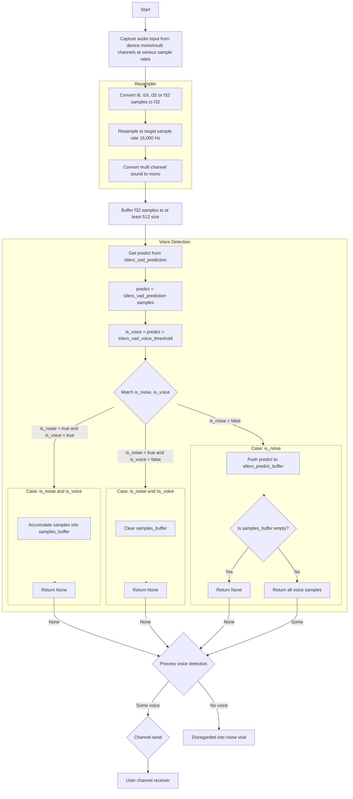

# Voice Stream

A Rust library for real-time voice activity detection and audio stream processing.
This library provides a high-level interface for capturing audio input,
performing voice detection using Silero VAD, and processing audio streams.

## Features

- Real-time audio capture from input devices
- Audio resampling to desired sample rate (default 16kHz)
- Voice activity detection using:
  - Silero VAD
- Configurable buffer sizes and voice detection parameters
- Channel-based audio data transmission
- Support for multiple sample formats (I8, I16, I32, F32)
- Conversion from multi channel to mono channel

## Usage

```rust,no_run
use voice_stream::VoiceStream;
use voice_stream::cpal::traits::StreamTrait;

#[tokio::main]
async fn main() -> Result<(), Box<dyn std::error::Error>> {
    // Create a default voice stream with receiver
    let (voice_stream, mut rx) = VoiceStream::default_device().unwrap();

    // Start capturing audio
    voice_stream.play().unwrap();

    // Receive voice data chunks
    loop {
        match rx.recv().await {
            Some(samples) => {
              // Process voice data (Vec<f32>)
              println!("Received voice data chunk of size: {}", samples.len());
            }
            _ => {}
        }

    }

    Ok(())
}
```

### Diagram



## Advanced Configuration

The library provides a builder pattern for advanced configuration:

```rust,no_run
use voice_stream::VoiceStreamBuilder;
use voice_stream::cpal::traits::{DeviceTrait, HostTrait, StreamTrait};
use tokio::sync::mpsc;

let (tx, mut rx) = mpsc::unbounded_channel();

let host = cpal::default_host();

let select_device = "default";

// Set up the input device and stream with the default input config.
let device = if select_device == "default" {
    host.default_input_device()
} else {
    host.input_devices()
        .expect("Failed to get input devices")
        .find(|x| x.name().map(|y| y == select_device).unwrap_or(false))
}
.expect("failed to find input device");

let config = device
    .default_input_config()
    .expect("Failed to get default input config");

let voice_stream = VoiceStreamBuilder::new(config, device, tx)
    .with_sound_buffer_until_size(1024)
    .with_voice_detection_silero_voice_threshold(0.5)
    .build()
    .unwrap();
```
